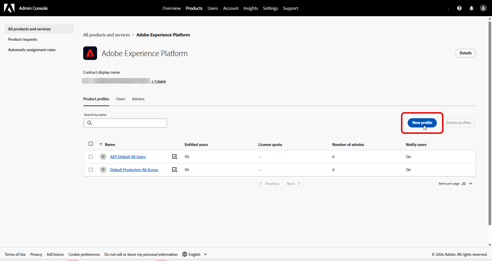

# Journey Optimizer 実験アクセラレーターへのアクセス

[実験を作成および設定](https://experienceleague.adobe.com/ja/docs/journey-optimizer/using/content-management/content-experiment/content-experiment)し、キャンペーンまたはジャーニーをプロファイルに送信した後、**[!UICONTROL Journey Optimizer 実験アクセラレーター]**&#x200B;にアクセスして、実験のパフォーマンスをより深く掘り下げることができます。

**[!UICONTROL Journey Optimizer 実験アクセラレーター]**&#x200B;には、[!UICONTROL 実験]ドロップダウンの左側のメニューから、またはアプリスイッチャーからアクセスできます。 Target ライセンスのみを持つユーザーは、アプリスイッチャーを通じてのみアクセスできます。

使用可能な実験は、設定によって異なります。

* **Adobe Journey Optimizer ユーザーの場合**：有効にした組織のサンドボックスで設定した実験は自動的に含まれます。

* **Journey Optimizer を使用している Adobe Target ユーザーの場合**：Target の任意の A/B アクティビティは、Journey Optimizer の本番稼働用サンドボックス内の **[!UICONTROL Journey Optimizer 実験アクセラレーター]**&#x200B;に表示されます。

* **Adobe Target のみのユーザーの場合**：Target 組織内のすべての A/B アクティビティは、Journey Optimizer の本番稼働用サンドボックスに含まれます。

**[!UICONTROL Journey Optimizer 実験アクセラレーター]**&#x200B;を使用するには、サンドボックスにアクセスし、関連する権限に従う必要があります。

* **[!UICONTROL 実験を表示]**
* **[!UICONTROL 実験メタデータを管理]**

+++ Adobe Experience PlatformまたはAdobe ジャーニーオプティマイザーライセンスで実験に関連する権限を割り当てる方法について説明します

1. **[!DNL Permissions]** 製品で、「**[!UICONTROL 役割]**」タブに移動し、目的の「**[!UICONTROL 役割]**」を選択します。

1. 「**[!UICONTROL 編集]**」をクリックして、権限を変更します。

1. **[!UICONTROL 実験アクセラレーター]**&#x200B;のリソースを追加し、ドロップダウンメニューから「**[!UICONTROL 実験を表示]**」または「**[!UICONTROL 実験メタデータを管理]**」を選択します。

   

1. 「**[!UICONTROL 保存]**」をクリックして、変更を適用します。

この役割に既に割り当てられているユーザーの権限は、自動的に更新されます。

この役割を新しいユーザーに割り当てるには：

1. 役割ダッシュボード内の「**[!UICONTROL ユーザー]**」タブに移動し、「**[!UICONTROL ユーザーを追加]**」をクリックします。

1. ユーザーの名前、メールアドレスを入力するか、リストから選択して、「**[!UICONTROL 保存]**」をクリックします。

   まだユーザーを作成していない場合は、[このドキュメント](https://experienceleague.adobe.com/ja/docs/experience-platform/access-control/abac/permissions-ui/users)を参照してください。

ユーザーは、インスタンスにアクセスする手順が記載されたメールを受信します。

+++

 

+++ Adobe Target ライセンスで実験に関連する権限を割り当てる方法について説明します

1. **[Admin Console](http://adminconsole.adobe.com/)**&#x200B;を開きます。

1. **[!UICONTROL 製品]**&#x200B;で、**[!UICONTROL Adobe Experience Platform]**&#x200B;を選択します。

1. 「**[!UICONTROL 新規プロファイル]**」をクリックします。

   

1. プロファイルに&#x200B;**[!UICONTROL 名前]**&#x200B;と&#x200B;**[!UICONTROL 説明]**&#x200B;を入力し、**[!UICONTROL 保存]**&#x200B;をクリックします。

1. 新しく作成した&#x200B;**[!UICONTROL プロファイル]**&#x200B;を開き、**[!UICONTROL 権限]** タブに移動します。

1. **[!UICONTROL experimentation-accelerator]**&#x200B;権限の横にあるをクリックします。

   

1. **[!UICONTROL 実験の表示]**&#x200B;や&#x200B;**[!UICONTROL 実験メタデータの管理]**&#x200B;など、このプロファイルに必要な権限を追加し、**[!UICONTROL 保存]**&#x200B;をクリックします。

   >[!TIP]
   >
   > 利用者が異なるアクセスレベルを必要とする場合は、個別のプロファイルを作成します。 例えば、**[!UICONTROL 実験を表示]**&#x200B;のみを使用する&#x200B;**[!UICONTROL Experimentation Accelerator ビューア]** プロファイルと、**[!UICONTROL 実験を表示]**&#x200B;および&#x200B;**[!UICONTROL 実験メタデータを管理]**&#x200B;の両方を使用する&#x200B;**[!UICONTROL Experimentation Accelerator エディター]** プロファイルを作成します。

   

1. 「**[!UICONTROL 権限]**」タブから、**[!UICONTROL サンドボックス]**&#x200B;を選択します。

1. ユーザーがJourney Optimizer Experimentation Acceleratorを使用できるサンドボックスを追加し、**[!UICONTROL 保存]**&#x200B;をクリックします。

1. 「**[!UICONTROL ユーザー]**」タブを開き、「**[!UICONTROL ユーザーを追加]**」をクリックします。

   

1. このアクセス権を受け取るユーザーを追加し、**[!UICONTROL 保存]**&#x200B;をクリックします。

このプロファイルに追加されたユーザーは、アプリスイッチャーからJourney Optimizer Experimentation Acceleratorにアクセスできるようになりました。

+++

<!--table style="table-layout:fixed"><tr style="border: 0;">
<td>

<strong><a href="experiment-accelerator-overview.md">Overview</a></strong>

</td>
<td>

<strong><a href="experiment-accelerator-monitor.md">Experiments</a></strong>

</td>
<td>

<strong><a href="experiment-accelerator-metrics.md">Metrics</a></strong>

</td>
</tr></table-->
