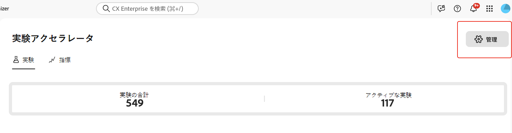
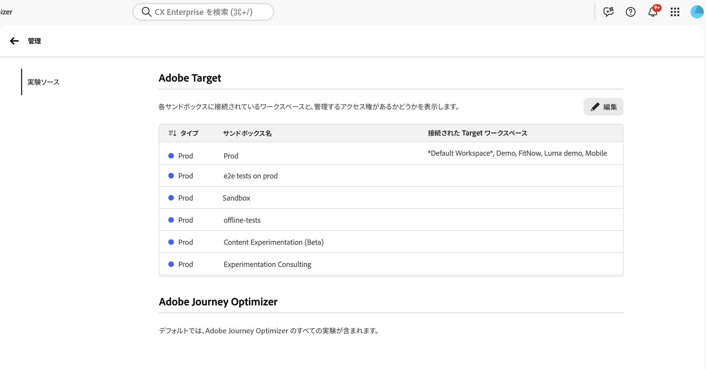
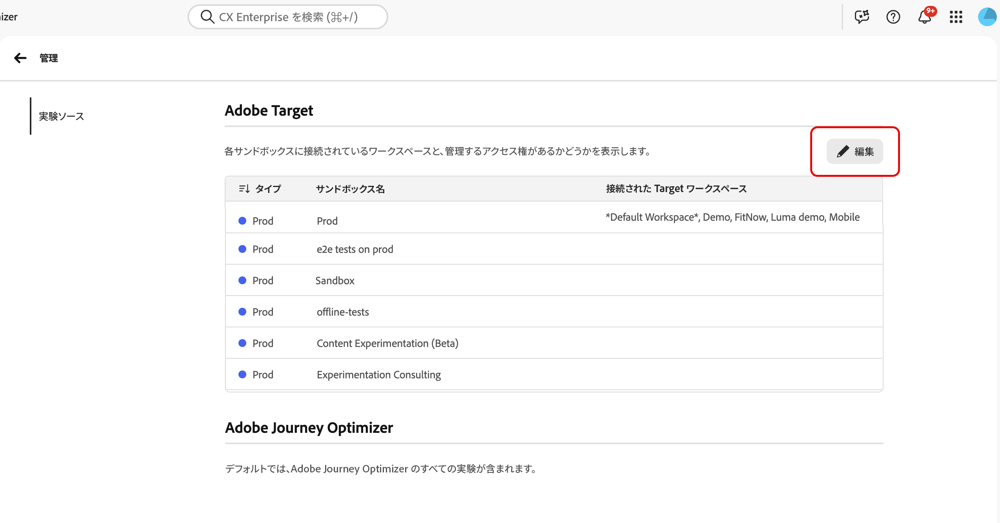
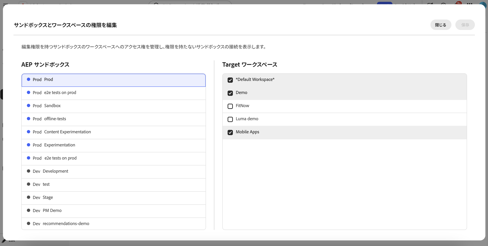

# [!DNL Target] と Experimentation Accelerator の統合

Experimentation Accelerator は、管理者が [!DNL Adobe Target] ワークスペースのアクティビティをアプリケーション内で整理および表示する方法を管理するのに役立ちます。各 [!DNL Target] ワークスペースを適切な Experimentation Accelerator サンドボックスにマッピングすると、チームは [!DNL Adobe Target] と [!DNL Adobe Journey Optimizer] から実験を 1 か所で確認できます。

➡️ [Adobe Experimentation Accelerator の詳細情報](https://experienceleague.adobe.com/ja/docs/experimentation-accelerator/using/overview)

## 始める前に

サンドボックスの割り当てを設定する前に、必要な権限があることを確認します。Experimentation Accelerator の&#x200B;**[!UICONTROL 管理]**&#x200B;にアクセスするには、**[!UICONTROL 設定を管理]**&#x200B;権限が必要です。

ユーザーは、次の 2 つの条件が満たされた場合にのみ、[!DNL Target] ワークスペースをサンドボックスに割り当てることができます。

* ユーザーに Experimentation Accelerator の&#x200B;**[!UICONTROL 設定を管理]**&#x200B;権限がある。
* ユーザーが [!DNL Target] 製品管理者である。

## [!DNL Target] ワークスペースのサンドボックスの割り当ての設定

ワークスペースを割り当てる前に、同じテストの重複エントリを防ぐために、[!DNL Target] ワークスペースは 1 つのサンドボックスにのみ割り当てることができます。

各 [!DNL Target]ト ワークスペースが表示されるサンドボックスを選択するには：

1. Experimentation Accelerator で、**[!UICONTROL 管理]**&#x200B;を開きます。

   

1. 現在の [!DNL Target] ワークスペースとサンドボックスの割り当てのテーブルを確認します。

   

1. 「**[!UICONTROL 編集]**」をクリックします。

   

1. 各サンドボックスに対して、適切な [!DNL Target] ワークスペースを割り当てます。

   

1. 「**[!UICONTROL 保存]**」をクリックして変更を適用します。

[!DNL Target] ワークスペースに対して最初の接続を作成した後、システムをまたいでアップデートが生成されるまで最大 30 分かかります。
