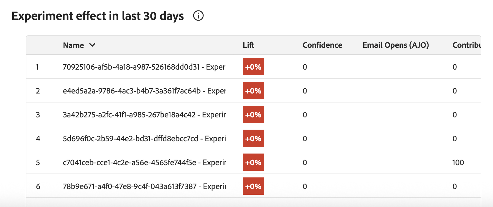

# 指標 {#experiment-accelerator-metrics}

**[!UICONTROL 指標]**&#x200B;ページには、Journey Optimizer 実験と Target 実験の成功指標が 1 か所に表示され、パフォーマンスのモニタリング、比較、より深いインサイトが実現します。

## ダッシュボード {#dashboard}

「**[!UICONTROL 指標]**」タブにアクセスすると、Journey Optimizer と Adobe Target の使用可能なすべての成功指標が統合ビューにリストされるので、イニシアチブをまたいでパフォーマンスを追跡し、結果を比較し、注意が必要な領域をすばやく特定するのに役立ちます。

「」をクリックしてフィルターにアクセスします。これにより、**[!UICONTROL ソース]**&#x200B;や&#x200B;**[!UICONTROL アクティブな実験で使用]**&#x200B;によるフィルタリングなどのコンテキスト固有のオプションを使用できます。

または、検索バーに指標の名前を入力して、指標をすばやく見つけることもできます。

## 指標の詳細 {#metric-details}

### 増分値の推移

**[!UICONTROL 増分値の推移]**&#x200B;グラフでは、選択した指標が選択した期間をまたいでどのように推移しているかを視覚的に確認できます。 ドロップダウンメニューを使用して、毎日または毎週のビューを切り替え、精度のレベルを調整します。

クイックリファレンスとして次の概要値を使用できます。

* **[!UICONTROL 合計]**：レポート期間中の選択した指標の累積値。

* **[!UICONTROL 平均]**：選択した時間範囲をまたいで計算された指標の標準値。 毎日または毎週の変動のバランスを取ることで、通常のパフォーマンスをより明確に把握し、比較のベースラインとして使用できます。

* **[!UICONTROL コンバージョン率]**：処理を確認した後に目的のアクション（例：購入、新規登録）を完了したプロファイルの割合。

各値には前期からの割合の変化が含まれるので、パフォーマンスが向上しているか、低下しているか、安定しているかを簡単に確認できます。

### 実験効果

このセクションには、選択した期間（過去 90 日間、過去 30 日間、過去 7 日間） 内のすべてのアクティブな実験が表示され、その指標に対する貢献度がハイライト表示されます。

次の指標を使用できます。

* **[!UICONTROL 上昇率]**：ベースラインに対する特定の処理のコンバージョン率の向上率を測定します。

* **[!UICONTROL 信頼性]**：ある処理がベースライン処理と同じであることを示す証拠。 [詳細情報](http://experienceleague.adobe.com/ja/docs/journey-optimizer/using/content-management/content-experiment/technotes/experiment-calculations)

* **[!UICONTROL 貢献度]**：特定の実験または処理に起因する指標の全体的な変化の割合。これにより、相対的に最も大きな影響を与えているイニシアチブを特定できます。
